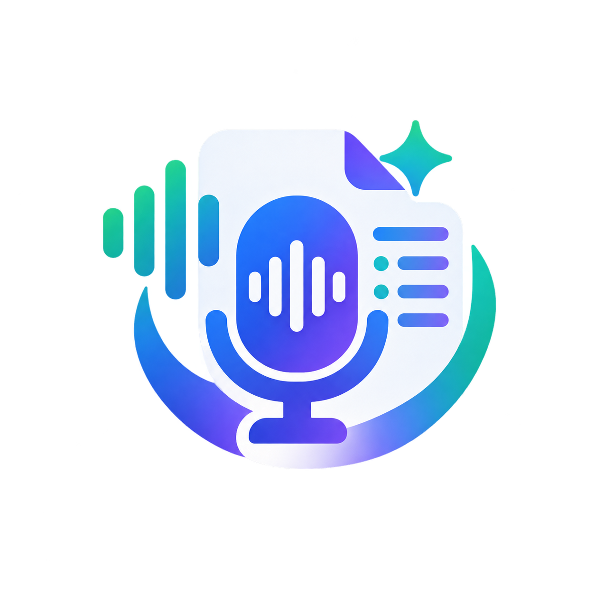
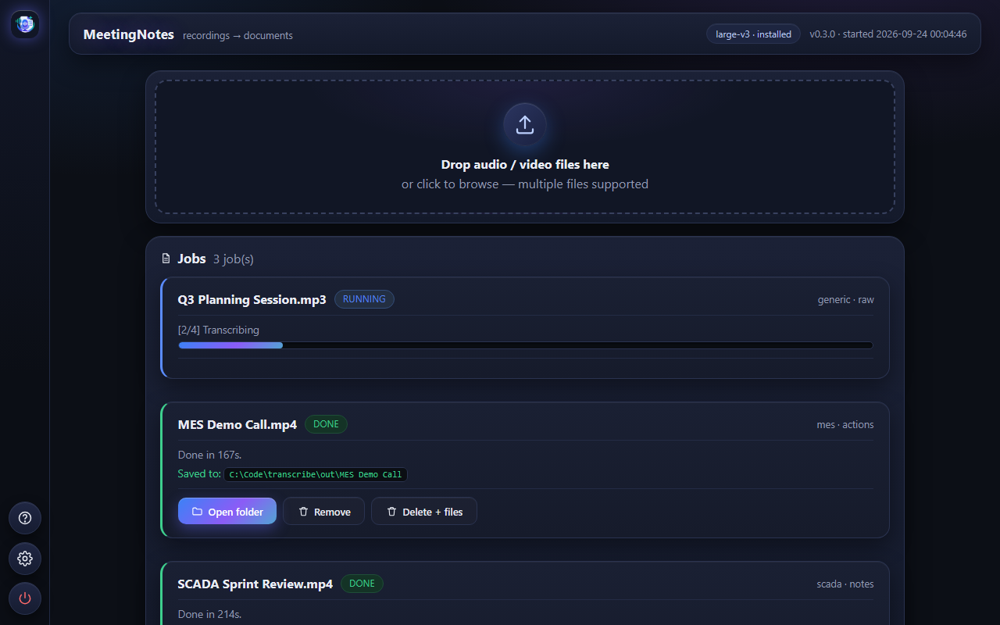
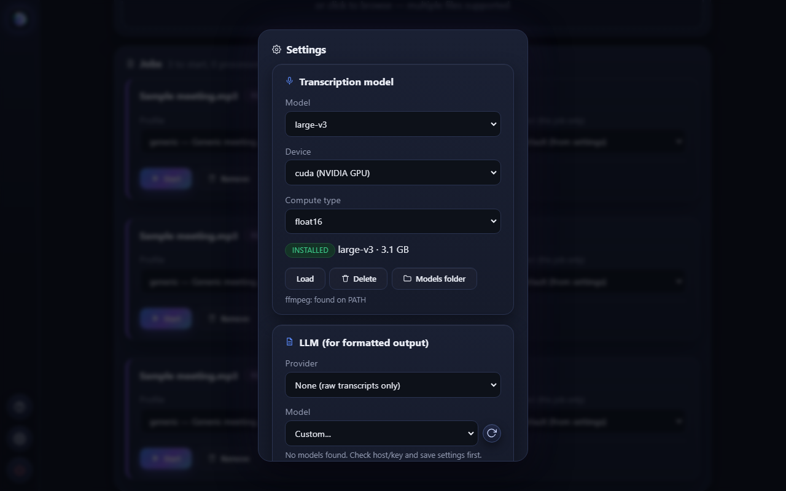

# MeetingNotes



MeetingNotes turns meeting recordings into text documents. Drop in a video or
audio file, and it writes out a transcript, notes, a list of action items, or a
test plan. Everything runs on your own computer.



## Getting started

1. Download `MeetingNotes-<version>-win64.zip` from Releases and unzip it
   anywhere.
2. Run `meetingnotes.exe`.
3. Follow the setup walkthrough: it walks you through picking a model and the
   language of your recordings, adding a recording, and running it. The
   formatted-output (LLM) step is optional and can be skipped.

No recording handy? "Try with a sample" stages a short built-in clip, so you
can take the whole thing for a spin first.

No installer, no admin rights, no account. The app keeps everything it needs in
its own folder, so deleting the folder removes it completely.

The transcription model isn't included in the zip. It's too large to ship
(75 MB to 3 GB depending on the model). You download it once from inside the
app. After that, transcription runs entirely offline; only cloud LLM output
needs an internet connection.

## What it does

| Stage | What happens |
|-------|--------------|
| Extract | Takes the audio out of any video or audio file |
| Transcribe | Turns speech into text using a Whisper model on your GPU (or CPU) |
| Correct | Fixes terms Whisper misheard, using a domain glossary |
| Write (optional) | An LLM turns the transcript into notes, actions, a test plan, or a summary |

The first three stages need nothing but the app. The last stage needs an LLM:
either a local one (Ollama, LM Studio, any OpenAI-compatible server) or a cloud
key (Ollama Cloud, OpenRouter, Anthropic, OpenAI). If you only need plain
transcripts, you can skip the LLM entirely.

A run can be stopped from its job card; cancelled jobs stay in the list and
can be started again.

## Transcript quality

Whisper often mishears technical words. A recording about SCADA tools, for
example, comes out with "скандала" instead of "SCADA". MeetingNotes fixes this
with a glossary per domain: 14 profiles (software, business, medical, legal,
finance, education, science, marketing, support, HR, dashboard, SCADA, MES,
generic); the common ones ship dictionaries in up to 6 languages
(RU/EN/ES/DE/FR/PT). The right language variant loads from the audio language
automatically, and you can change profile or language per file.

Raw output before correction:

```
мы используем скандала для мониторинга
```

After correction:

```
мы используем SCADA для мониторинга
```

## Results

Each job writes its files into its own folder under `results/`:

- `<name>.raw.txt`: the transcript as Whisper produced it
- `<name>.txt`: the transcript after glossary correction
- `<name>.json`: segments with timestamps (start, end, text)
- `<name>.<task>.md`: the LLM document (`notes`, `actions`, `testplan`, …),
  written when you chose a formatted output

## Command line

`meetingnotes-cli.exe` does the same work without a window, for scripts and
automation:

```powershell
meetingnotes-cli run meeting.mp4 --task raw --json
```

It supports `--json` output and stable exit codes (0 = success, 1 = usage
error, 2 = processing error). The full list of commands, flags, and recipes is
in [AGENTS.md](AGENTS.md).



## Requirements

- Windows 10 or 11, 64-bit
- An NVIDIA GPU is recommended. Without one, transcription still works but
  runs on the CPU and takes longer per minute of audio.

## Development

Setup and test instructions are in [CONTRIBUTING.md](CONTRIBUTING.md).

## License

[MIT](LICENSE)
